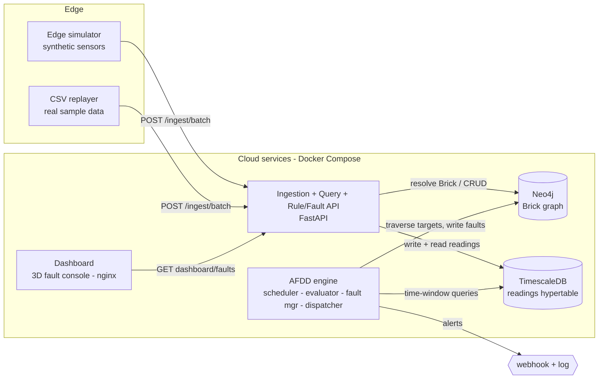
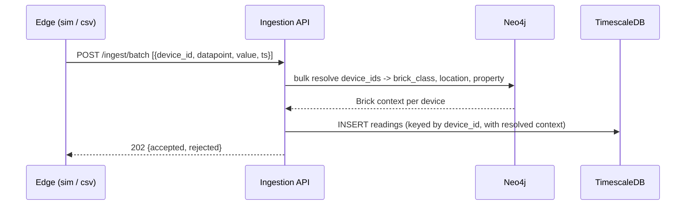
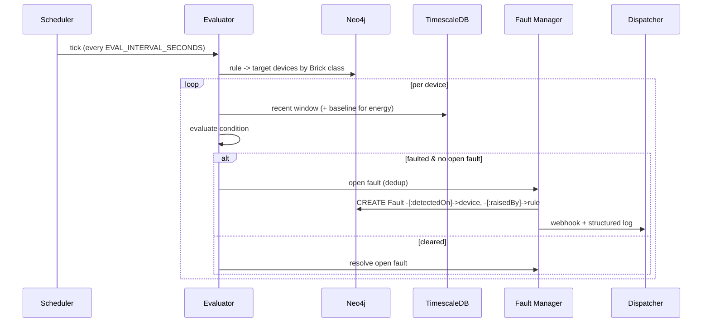

# Architecture — Multi-Site AFDD with Brick Schema (Graph DB Edition)

> A multi-site Automated Fault Detection & Diagnostics (AFDD) platform that models
> buildings as a **Brick Schema graph** (Neo4j), stores high-volume sensor readings in
> a **time-series database** (TimescaleDB), and runs a **Brick-aware fault-detection
> engine** that answers one question: *"What equipment needs attention, and why?"*

This document is the single, reviewer-facing overview. Deeper material lives in
[`docs/`](docs/) (ADRs, sequence diagrams, Brick model, scalability, AI-readiness) and a
[requirements traceability matrix](docs/requirements-traceability.md).

---

## 1. What it does

The platform ingests sensor telemetry from many properties, attaches **semantic meaning**
to each reading via a Brick ontology graph, continuously evaluates configurable rules
against recent data, and raises **faults** with full diagnostic context — surfaced on a
live 3D operations console. It is designed to scale from a handful of buildings to 400+
properties while keeping the same model and code.

---

## 2. High-level architecture



**Data flow in one line:**
`Edge → Ingestion API (Brick resolution via graph) → TimescaleDB → AFDD engine (traverse + evaluate) → Fault nodes in Neo4j → alerts + dashboard.`

---

## 3. Components

| Component | Responsibility | Technology | Port |
|---|---|---|---|
| **edge-simulator** | Simulates 3 hotels' sensors; injects realistic fault patterns; pushes batches. | Python | — |
| **csv-replayer** | Streams AltoTech's real sample CSVs into a dedicated `hotel_live` property. | Python | — |
| **api** | Ingestion (Brick resolution), data query, rule CRUD, fault actions, dashboard data, health, metrics, Swagger. | FastAPI / Uvicorn | 8000 |
| **afdd-engine** | Periodic rule evaluation: scheduler → condition evaluator → fault manager → alert dispatcher. | Python / APScheduler | — |
| **neo4j** | Brick graph: `Property → Location → Device` typed by `BrickClass`, plus `Rule` and `Fault` nodes. | Neo4j 5 Community | 7474/7687 |
| **timescaledb** | High-volume readings hypertable + hourly continuous aggregate. | TimescaleDB (Postgres 16) | 5432 |
| **dashboard** | Live 3D building map, KPIs, severity charts, activity log; reverse-proxies the API. | HTML + Three.js + Chart.js + nginx | 8080 |
| **graph-loader** | One-shot init job: applies schema + loads topology into Neo4j (idempotent). | Python | — |

A **shared library** (`packages/shared/afdd_shared`) is the single source of truth for the
Brick mapping, topology builder, Pydantic models, config, logging, and DB clients — imported
by every service so nothing drifts.

---

## 4. Key data flows

### 4.1 Ingestion with Brick resolution

The payload **never carries `brick_class`** — it is resolved from the graph at ingestion in
a single bulk round-trip (throughput-friendly).

### 4.2 AFDD evaluation cycle


---

## 5. Data architecture — the central decision

Buildings are graphs; Brick Schema is a graph ontology. But a graph database is poor at
high-volume time-series writes. We therefore **split storage by access pattern**:

| Concern | Store | Why |
|---|---|---|
| Topology + semantics (slow-changing, relationship-rich) | **Neo4j** | "Which devices are temperature sensors on Floor 2?" is a traversal, not a join. |
| Sensor readings (high-write firehose) | **TimescaleDB** | Hypertable partitioning + continuous aggregates handle millions of rows; native time-window queries. |
| Link between them | `device_id` | Neo4j answers *which* devices; TimescaleDB answers *what values* over time. |

**Graph model (Neo4j).** Nodes: `Property`, `Location`, `Device`(`:Point`), `BrickClass`,
`Rule`, `Fault`. Edges: `hasPart`, `hasPoint`, `hasLocation`, `rdf_type` (Brick typing),
`targets`, `detectedOn`, `raisedBy`. Because a `Rule` targets a `BrickClass` and devices are
typed by `rdf_type`, adding a new device/class auto-enables matching rules with **no code change**.

**Time-series model (TimescaleDB).** `readings(time, device_id, property_id, brick_class,
datapoint, value, value_text)` as a hypertable, plus a `readings_hourly` continuous aggregate
used by rolling-average rules. See [ADR-0002](docs/adr/0002-timeseries-boundary.md).

---

## 6. AFDD engine

Four collaborating parts, all stateless between runs (state lives in Neo4j):
- **Scheduler** (APScheduler) — runs evaluation on a configurable interval.
- **Condition evaluator** — resolves each rule's target devices by graph traversal, pulls the
  recent time-window from TimescaleDB, and applies the rule's evaluator.
- **Fault manager** — creates/resolves `Fault` nodes through the lifecycle
  `detected → active → acknowledged → resolved`, with `WHERE NOT EXISTS` **dedup** so the
  same device+rule never double-fires.
- **Alert dispatcher** — pluggable adapters (structured log + webhook; Telegram/email/PagerDuty
  are ~30-line additions).

**Rules are data + a plugin registry.** A rule is a graph node
(`brick_class_target`, `condition_type`, `params`, `property_overrides`); new rule *instances*
need no deploy. New rule *types* register an evaluator via `@register("...")`. Four rules ship:
temperature excursion, sensor flatline, schedule violation, energy anomaly.

---

## 7. API surface (`/api/v1`)

| Area | Endpoints |
|---|---|
| Ingestion | `POST /ingest`, `POST /ingest/batch` |
| Data query | `GET /devices/{id}/latest`, `GET /devices/{id}/readings?from&to`, `GET /devices?brick_class=&property=&floor=` |
| Setup | `POST/GET /properties`, `POST /devices` |
| Rules | `POST/GET/PUT/DELETE /rules`, `PATCH /rules/{id}/enable` |
| Faults | `GET /faults`, `GET /faults/{id}`, `POST /faults/{id}/{ack,resolve,notes}` |
| Dashboard | `GET /dashboard/{summary,stats,topology,readings}` |
| Ops | `GET /health`, `GET /ready`, `GET /metrics`, `/docs` (Swagger) |

---

## 8. Technology choices vs. enterprise options

Everything runs **free and local**; each choice names its enterprise upgrade path.

| Concern | POC choice | Enterprise option | Why POC choice |
|---|---|---|---|
| Graph DB | Neo4j Community | Neo4j Aura / clustered Enterprise, or managed RDF store | Best tooling + browser for the demo; zero cost. |
| Time-series | TimescaleDB (self-hosted) | Timescale Cloud / managed Postgres | Hypertables + continuous aggregates; one container. |
| Rule scheduling | APScheduler (in-process) | Celery + Redis / Temporal / cloud scheduler | No broker infra; engine is stateless so it's swappable. |
| Alerting | webhook + structured log | Message queue → email/SMS/PagerDuty/Teams | Zero external accounts; adapter pattern proves extensibility. |
| API | FastAPI | Same, behind an API gateway + WAF + authn | Async, auto-OpenAPI, minimal boilerplate. |
| Orchestration | Docker Compose | Kubernetes (manifests in `deploy/k8s`) | One-command local startup. |
| AuthN/Z | none (POC) | OAuth2/OIDC + RBAC + per-tenant API keys | Out of scope for a detection POC. |
| Secrets | `.env` defaults | Vault / cloud secret manager | Simplicity; documented. |

---

## 9. Scaling to 100+ sites

Three independent axes (detail in [scalability](docs/architecture/scalability.md)):
- **Job distribution** — shard rule evaluation by `property_id` across Celery/Temporal workers;
  the engine is stateless and dedup lives in the graph, so workers can't double-open faults.
- **Graph queries** — the Brick graph stays small (readings are *not* in it), so traversals stay
  fast; add read replicas and scope by property.
- **Time-series** — hypertable chunking + compression + continuous aggregates; shard by
  property/time; cold chunks to object storage.

Multi-tenancy: every node is reachable from exactly one `Property`; rules carry
`property_overrides` for per-site thresholds — "3 hotels with isolated configs", generalised to 400.

---

## 10. Reliability, security, observability

- **Health/readiness** — `/health` (liveness) and `/ready` (checks Neo4j + TimescaleDB);
  Docker `HEALTHCHECK`s gate startup ordering.
- **Resilience** — the engine isolates each device evaluation in `try/except` and guards its
  initial cycle, so one bad reading/rule can't crash it.
- **Observability** — structured JSON logs across services; Prometheus metrics at `/metrics`
  (scrape config in `deploy/prometheus`).
- **AI-ready** — graph/rules/faults export as JSON; a Claude Code `skills/SKILL.md` lets an AI
  generate valid rule configs ([ai-ready](docs/architecture/ai-ready.md)).
- **Security (POC scope)** — permissive CORS, default credentials in `.env`; production path
  named above (gateway, OIDC, RBAC, secret manager, TLS).

---

## 11. Repository map

```
services/
  api/             FastAPI app (routers: ingest, query, devices, rules, faults, dashboard, health)
  afdd-engine/     scheduler + evaluator + fault_manager + dispatcher + rules/ (4 evaluators)
  edge-simulator/  configurable synthetic sensors + anomaly injectors
  csv-replayer/    streams real sample CSVs into hotel_live
  dashboard/       single-page 3D console (nginx + reverse proxy to api)
packages/shared/   Brick mapping, topology builder, models, config, DB clients (one source of truth)
graph/             Cypher schema + idempotent topology loader
deploy/            docker-compose, .env.example, timescale init.sql, topology.yaml, k8s, prometheus
docs/              ADRs, architecture, Brick design, scalability, AI-ready, RTM, wiki, DEMO, interview-defense
skills/            bonus Claude Code SKILL.md (Brick + AFDD)
tests/integration/ live end-to-end smoke test
.github/workflows/ CI (lint + per-service unit tests + image builds)
```

---

## 12. Running it

```bash
cd deploy
cp .env.example .env
docker compose up --build
```

| URL | What |
|---|---|
| http://localhost:8080 | 3D Fault Console (light/dark, hover a room for live readings) |
| http://localhost:8000/docs | Swagger UI |
| http://localhost:7474 | Neo4j Browser (explore the Brick graph) |

Verify end-to-end with `python tests/integration/smoke_test.py`. Demo walkthrough:
[`docs/DEMO.md`](docs/DEMO.md).

---

## 13. Design decisions (ADRs)

[0001 Graph DB](docs/adr/0001-graph-database.md) ·
[0002 Time-series boundary](docs/adr/0002-timeseries-boundary.md) ·
[0003 Alerting](docs/adr/0003-alerting-dispatcher.md) ·
[0004 Scheduler](docs/adr/0004-afdd-scheduler.md) ·
[0005 Framework](docs/adr/0005-backend-framework.md)
