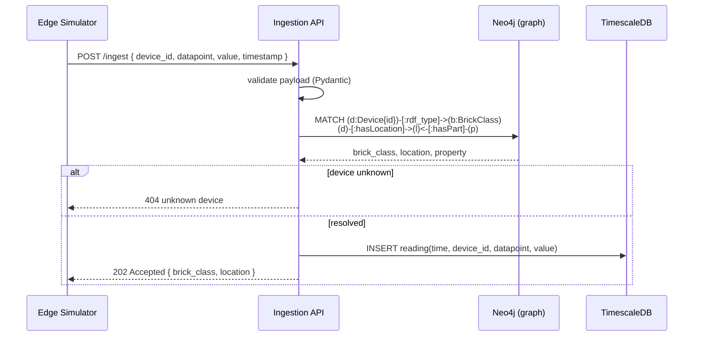
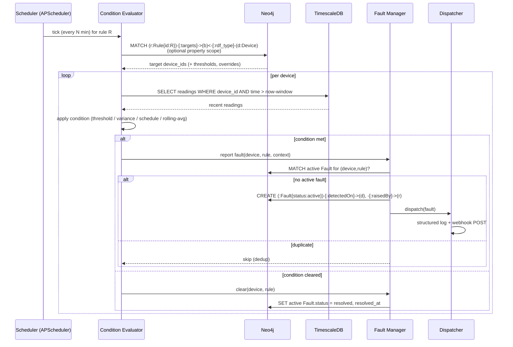
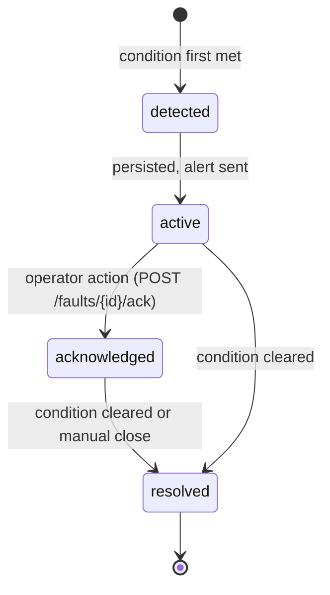

# Sequence Diagrams — Key Operations

## 1. Ingestion with Brick resolution

Note: `brick_class` is **never** sent by the simulator — it is resolved from the graph at ingestion.

## 2. AFDD evaluation cycle

## 3. Fault lifecycle

