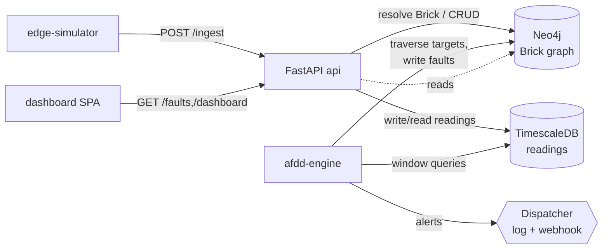

# System Architecture — Multi-Site AFDD

High-level component overview and the connectivity between modules. Diagrams are Mermaid (render on GitHub / Wiki).

## Components

| Service | Responsibility | Stores it touches |
|---|---|---|
| **edge-simulator** | Simulates 3 hotels' sensors; pushes readings to the API on a configurable interval; injects realistic anomalies. | — (HTTP client) |
| **api** (FastAPI) | Ingestion (Brick resolution), data query, rule CRUD, fault actions, dashboard data, health, metrics, Swagger. | Neo4j (read/write), TimescaleDB (read/write) |
| **afdd-engine** | Scheduler → evaluator → fault manager → dispatcher. Resolves rule targets by graph traversal, evaluates windows, manages fault lifecycle, alerts. | Neo4j (read/write), TimescaleDB (read) |
| **neo4j** | Brick graph: topology + semantics + rules + faults. | — |
| **timescaledb** | Reading hypertable (high-volume time-series). | — |
| **dashboard** | Read-only single-page UI (light/dark, mobile). | api (HTTP) |

## Component connectivity



## Data flow (end-to-end)

```
Edge Simulator
   → Ingestion API  (validate → Cypher lookup: device → Brick class + location + property)
   → TimescaleDB    (store reading keyed by device_id, with resolved Brick context)
AFDD Engine (every N min)
   → Neo4j          (traverse: devices of rule's target Brick class, scoped by property)
   → TimescaleDB    (query recent window per device)
   → evaluate condition
   → Neo4j          (create/resolve Fault node; dedup active faults)
   → Dispatcher     (structured log + webhook)
Dashboard / Swagger
   → API            (fault counts, severity distribution, active faults)
```

## Multi-tenancy / isolation
Every `Location`, `Device`, `Rule`, and `Fault` is reachable from exactly one `Property`. Queries scope by `property_id`; rules support `property_overrides` for per-hotel thresholds. This isolates the 3 hotels' configs while sharing one platform — the model extends unchanged to 400 properties.

See also: [data-flow sequence diagrams](data-flow.md), [Brick model](../brick-schema/brick-model.md), [ADRs](../adr/README.md).
