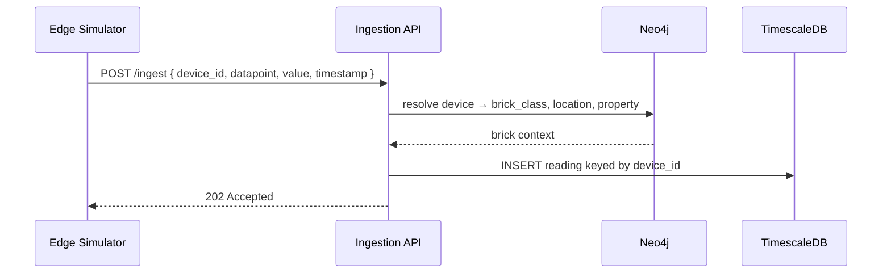
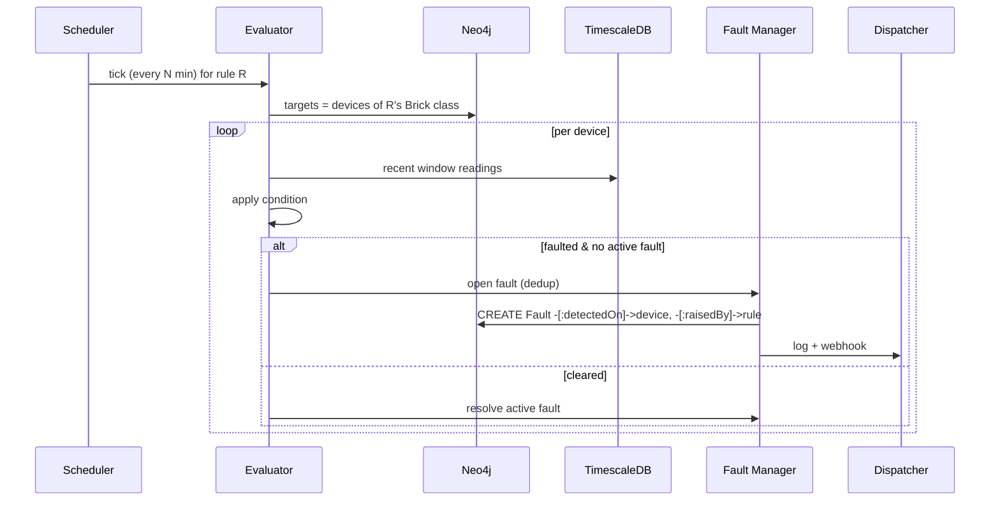
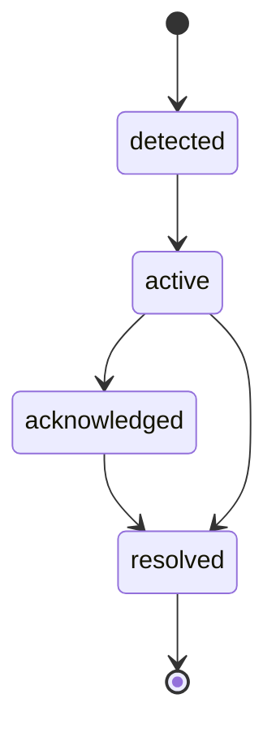

# Flow Charts & Sequence Diagrams

Full detail: [`docs/architecture/data-flow.md`](../architecture/data-flow.md).

## Ingestion with Brick resolution

`brick_class` is resolved from the graph, never sent on the wire.

## AFDD evaluation cycle

## Fault lifecycle

