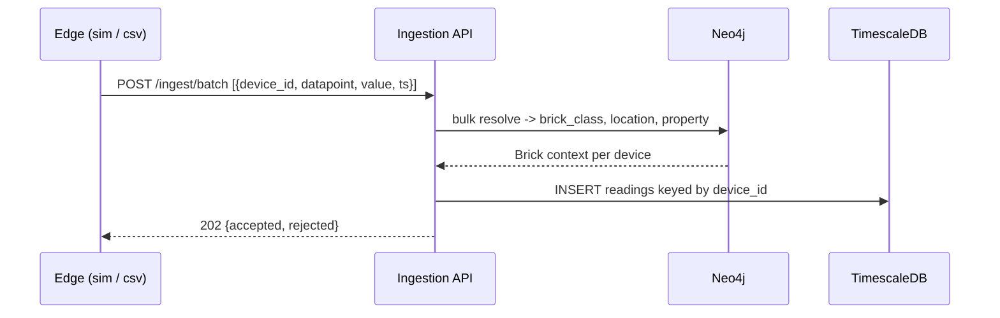
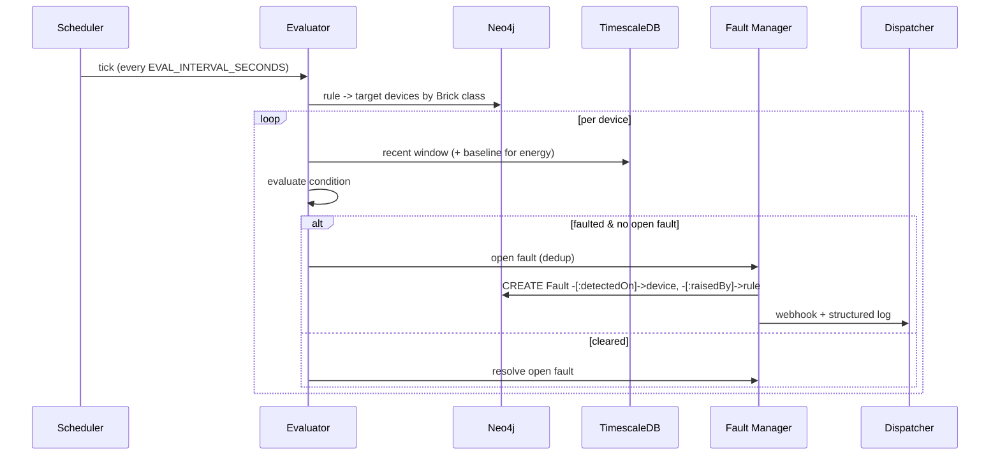
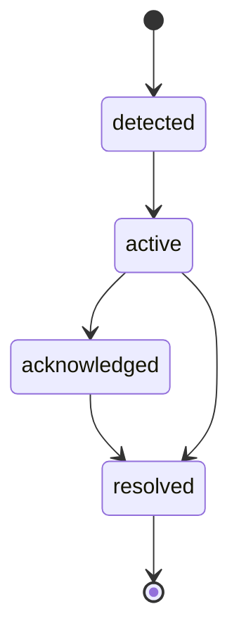

# Flow Charts & Sequence Diagrams

## Ingestion with Brick resolution

`brick_class` is resolved from the graph, never sent on the wire.

## AFDD evaluation cycle


## Dashboard read (live 3D console)
```mermaid
sequenceDiagram
  participant UI as Dashboard SPA
  participant API as API
  participant NEO as Neo4j
  participant TS as TimescaleDB
  UI->>API: GET /dashboard/stats, /summary, /topology, /readings, /faults
  API->>NEO: counts, fault aggregates, building topology + per-room status
  API->>TS: ingest rate, latest value per device
  API-->>UI: JSON
  Note over UI: rooms colored by worst fault; hover shows live readings
```

## Fault lifecycle

