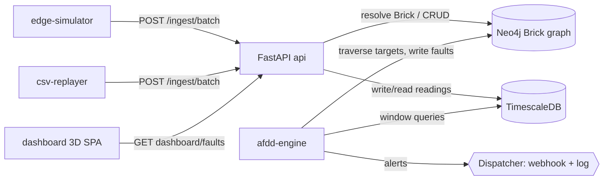

# System Architecture

Component overview and module connectivity. Full detail:
[`ARCHITECTURE.md`](https://github.com/vanowarna/altotech-task-1/blob/main/ARCHITECTURE.md).

## Components (8 services)
| Service | Responsibility | Stores |
|---|---|---|
| edge-simulator | simulate 3 hotels' sensors; inject fault patterns; push batches | — |
| csv-replayer | stream real sample CSVs into the `hotel_live` property | — |
| api (FastAPI) | ingestion (Brick resolution), query, rules, faults, dashboard data | Neo4j, TimescaleDB |
| afdd-engine | scheduler → evaluator → fault manager → dispatcher | Neo4j, TimescaleDB |
| neo4j | Brick graph: topology + semantics + rules + faults | — |
| timescaledb | reading hypertable + hourly continuous aggregate | — |
| dashboard | single-page 3D console (nginx + reverse proxy) | api |
| graph-loader | one-shot: schema + topology load (idempotent) | Neo4j |

## Connectivity

## Multi-tenancy
Every `Location`, `Device`, `Rule`, and `Fault` is reachable from exactly one `Property`.
Queries scope by `property_id`; rules carry `property_overrides` for per-site thresholds. The
model extends unchanged from 4 properties to 400.
