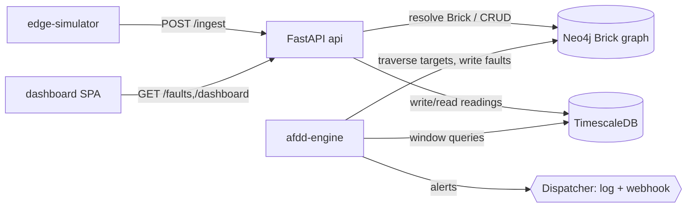

# System Architecture

Component overview and module connectivity. Full detail: [`docs/architecture/system-overview.md`](../architecture/system-overview.md).

## Components
| Service | Responsibility | Stores |
|---|---|---|
| edge-simulator | simulate 3 hotels' sensors; push readings; inject anomalies | — |
| api (FastAPI) | ingestion (Brick resolution), query, rules, faults, dashboard data | Neo4j, TimescaleDB |
| afdd-engine | scheduler → evaluator → fault manager → dispatcher | Neo4j, TimescaleDB |
| neo4j | Brick graph: topology + semantics + rules + faults | — |
| timescaledb | reading hypertable (high-volume time-series) | — |
| dashboard | read-only single-page Fault Console | api |

## Connectivity

## Multi-tenancy
Every `Location`, `Device`, `Rule`, and `Fault` is reachable from exactly one
`Property`. Queries scope by `property_id`; rules carry `property_overrides`. Three
hotels share one platform with isolated configs — the model extends unchanged to 400
properties.
